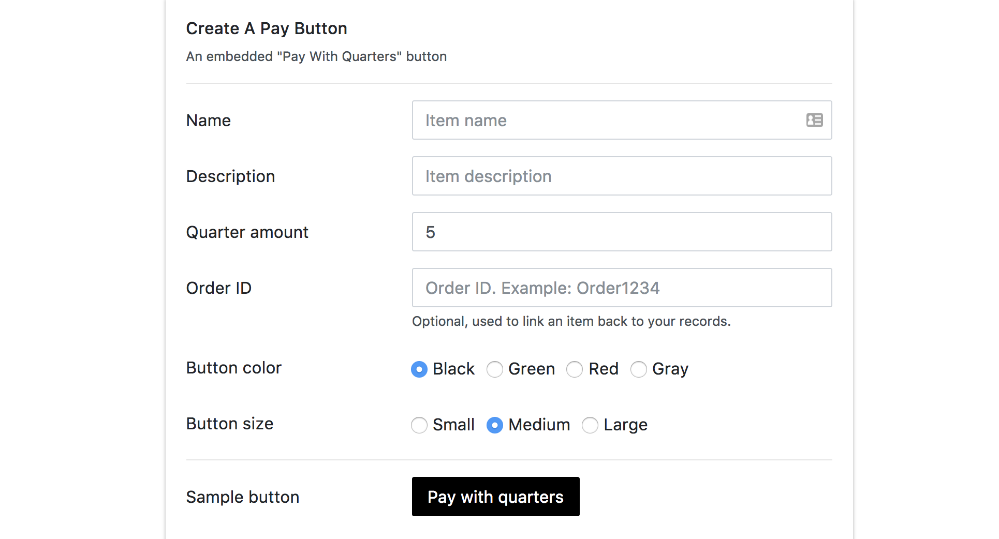
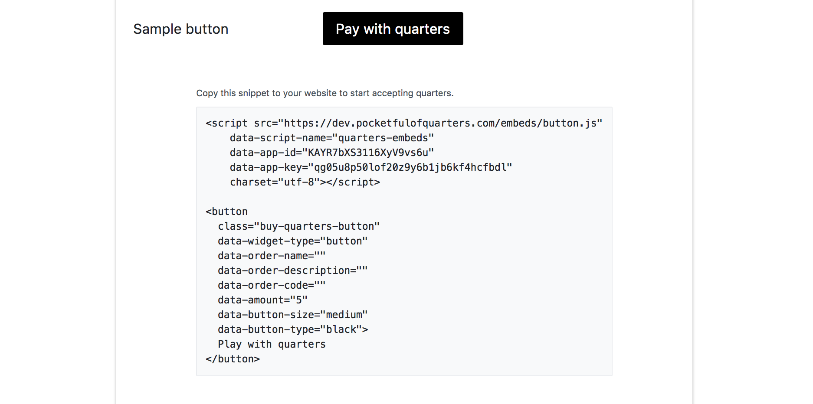

# Quarters Buttons

### Integrate Quarters on your website in an embedded window

**Sample Button**

<div></div>

<button
  class="buy-quarters-button"
  data-widget-type="button"
  data-order-name="Sample docs"
  data-order-description="Sample quarters transfer"
  data-order-code="1"
  data-amount="5"
  data-button-size="medium"
  data-button-type="black">
  Play with quarters
</button>

<script src="https://dev.pocketfulofquarters.com/embeds/button.js"
    data-script-name="quarters-embeds"
    data-app-id="KAYR7bXS3116XyV9vs6u"
    data-app-key="qg05u8p50lof20z9y6b1jb6kf4hcfbdl"
    charset="utf-8"></script>

**Sample code**

When you create an quarters button, it will give you code like this example.

```html
<button
  class="buy-quarters-button"
  data-widget-type="button"
  data-order-name="Sample docs"
  data-order-description="Sample quarters transfer"
  data-order-code="1"
  data-amount="5"
  data-button-size="medium"
  data-button-type="black">
  Play with quarters
</button>

<script src="https://dev.pocketfulofquarters.com/embeds/button.js"
    data-script-name="quarters-embeds"
    data-app-id="KAYR7bXS3116XyV9vs6u"
    data-app-key="qg05u8p50lof20z9y6b1jb6kf4hcfbdl"
    charset="utf-8"></script>
```

### How to create Quarters Button

Quarters buttons can be generated via our button generator (shown below) once you create [your first app](guides/create-app.md)

The button generator is the easiest way to get started.



This will create code like this.



The only required parameters amount. The rest can be set when you create the button or later via the `data-*` attributes in the embed HTML. `data-*` attributes will override any attributes you set in the button generator.

Once a button is generated, you'll be given a few lines of HTML code to copy and paste into your website. This will add the button to your page.

Buttons can be thought of as disposable (they are just a way to hard code a name and price into a code attribute) so if you mess up you can always start over with a new button.

### Integration Details

A separate `requestId` is generated for each order and user. If a user is already signed in to a Quarters account, they can complete the checkout in two clicks - this is the fastest method of transfer.

```js
// Quarters button callback
wndow.onQuartersCallback = function(data) {
  if (data.error) {
    // data.message
  } else if (data.cancel) {
    // user canceled transfer
  } else {
    // data.txId => Ethereum transaction tx id
    // data.requestId => Request Id to get details about order (/v1/requests/:requestId)
  }
}
```

On successful transfer, following param will be generated:

Parameter | Description
--- | ---
`txId` | Ethereum transaction hash which you can use to validate confirmed transaction on blockchain
`requestId` | Order id which you can use to retrieve order details. <br>Order details can be fetched using `client_secret` (server key) using [Node SDK](node-sdk) <br>API: `/v1/requests/:requestId`
`order_code` | Order code. Same as code supplied using `data-order-code`. <br>Used when multiple buttons are there on a page to identify order.

### Advanced Options

#### Customizing the Embed HTML

The embed html consists of one script tag referencing `https://dev.pocketfulofquarters.com/embeds/button.js` and an element with class `buy-quarters-button` with `data-widget-type='button'`.

You can have one or more elements with class `buy-quarters-button` on the page (if you’re including multiple buttons), but only one script tag is ever needed.

After adding the `buy-quarters-button` class, the only required parameters are `data-amount` and `data-widget-type`. The other params can be updated after the button is created by setting `data-*` attributes on the element. This makes it easy to update fields without having to create a new button.

The div can have the following params:

Field | Description
--- | ---
`data-amount` | **Required** Integer amount of quarters for order.
`data-button-size` | **Optional** one of `medium`, `large` or `small`. <br>These different button styles can be previewed in the button generator. <br>Default is `medium`.
`data-button-type` | **Optional** one of `black`, `green`, 'red' or `grey`. <br>These different button types can be previewed in the button generator. <br>Default is `black`.
`data-order-name` | **Optional** Order name which be shown to user
`data-order-code` | **Optional** Unique code per page. <br>It will be used to identify multiple orders on same page.
